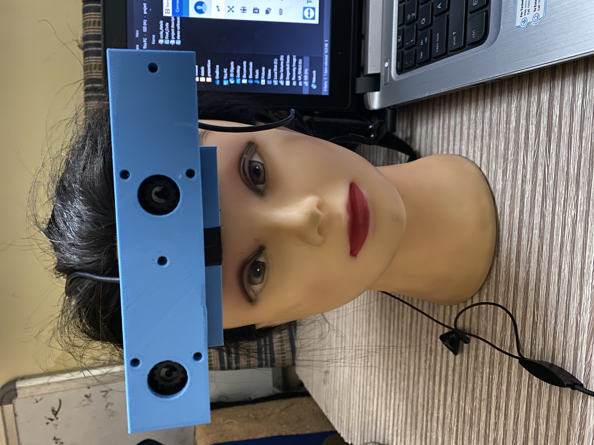

# New-Eye

The project was developed to help the blind people to see the world, well litrary they will not see but hear.

Device Image

**Project Idea:**

* *Navigation for the visually impaired is still a difficult task to be countered, even with current methodology and results in inconvenience and doesn’t efficiently battle impairment.*
* *Our solution to this is an innovative approach through which the visually impaired can navigate with more convenience and comfort.* 

In this device we used computer vision and text to speech conversion for helping the blind person to hear the distance how far he/she is from the object and what type of object in front of him/her And by using face recognition the person will identify who is the person in front of him/her .
The reason we are doing this is to give an eye to a person who never had seen the world. To help a person decide the safety of path which he/she had to travel and who is in front of them. This project is to make a blind person self-dependent rather asking for help and reducing the risk of thievery and molesting which is still potential threat to them.
We have realized that whilst learning it would benefit us more if the work that we do is directed towards solving a social problem or helping them.

## Technical Details: 
* Using 2 Logitech webcam which were set up like a eyeglasses (for stereo vision).
* The two-image feed coming from this cameras were than process using computer vision technique:
    - Object detection: yolov3 darknet architecture to detect the different object and their positions in the images.
    - Face verification and recognition: using the Siamese network train on large face datasets, which created a embeddings for the face to recognize the face in real time by computing the embeddings of the faces of unknown faces and using distance metric compare it with the known faces embeddings.
    - Depth sensing: using stereo vision to calculate the depth of the image or calculate the z axis to compute how far objects are in an environment from the devices.
    - Text-to-speech: Then the data is fed to a text to speech conversion we used google TTS for speech because of good conversion and clear voice.

>**Project Implementation details can be found [here](docs/code_details.docx)**

